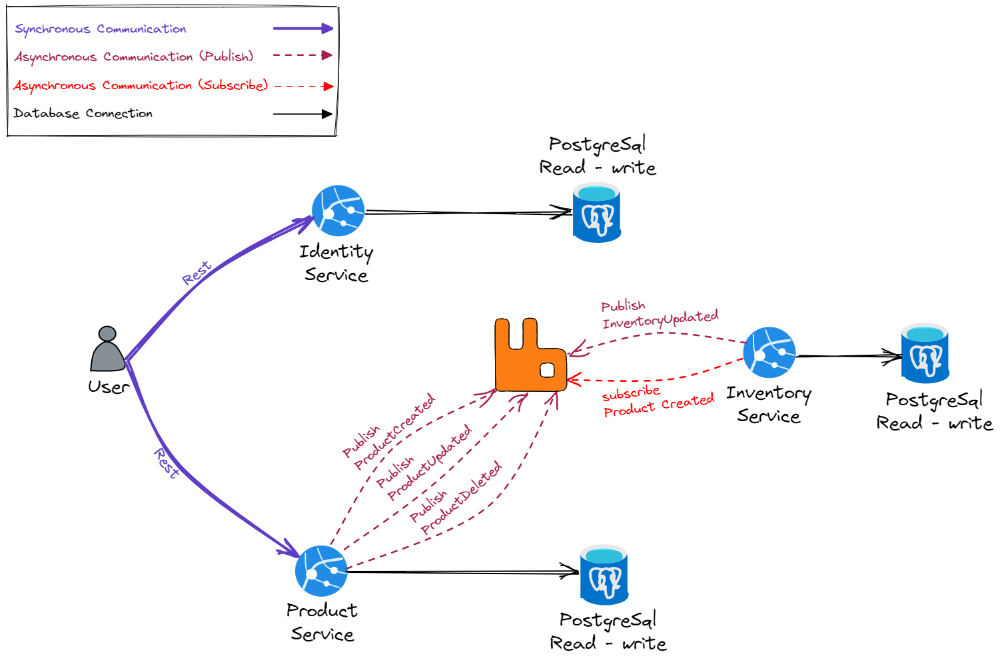

## TO RUN THIS PROJECT
```bash

make docker-compose_infra_up
make run_products_service
make run_identities_service


IF MAKE NOT INSTALLED


docker-compose -f deployments/docker-compose/infrastructure.yaml up --build
cd internal/services/product_service/ && 	go run ./cmd/main.go
cd internal/services/identity_service/ && 	go run ./cmd/main.go
```


# API Documentation

This documentation provides information about the Identity and Product API endpoints and how to use them in Postman.

## Base URLs

- Identity API: `http://localhost:5002`
- Product API: `http://localhost:5000`

## Authentication

The API uses OAuth 2.0 password grant type for authentication. You'll need to obtain a token before accessing protected endpoints.

### Getting an Access Token

```http
GET {{identity-api}}/connect/token
```

**Query Parameters:**
- `grant_type`: password
- `client_id`: clientId
- `client_secret`: clientSecret
- `scope`: all
- `username`: admin
- `password`: admin

**Headers:**
```
Content-Type: application/json
Accept: application/json
```

The response will contain an access token that you'll need for subsequent requests.

### Validating Token

```http
GET {{identity-api}}/validate-token
```

**Headers:**
```
Content-Type: application/json
Accept: application/json
Authorization: Bearer {your-access-token}
```

## Product API Endpoints

### Create Product

```http
POST {{product-api}}/api/v1/products
```

**Headers:**
```
Accept: application/json
Content-Type: application/json
Authorization: Bearer {your-access-token}
```

**Request Body:**
```json
{
  "description": "test-desc",
  "name": "test-product",
  "price": 20
}
```

### Update Product

```http
PUT {{product-api}}/api/v1/products/{product-id}
```

**Headers:**
```
Accept: application/json
Content-Type: application/json
Authorization: Bearer {your-access-token}
```

**Request Body:**
```json
{
  "description": "test-desc",
  "name": "test-product",
  "price": 40
}
```

## Setting Up in Postman

1. Create a new collection in Postman
2. Set up environment variables:
   - `identity-api`: `http://localhost:5002`
   - `product-api`: `http://localhost:5000`

3. For authenticated requests, you'll need to:
   - First make the token request
   - Copy the access token from the response
   - Use it in the `Authorization` header for subsequent requests

### Authentication Flow
1. Make the token request
2. The response will contain an `access_token`
3. Use this token in the `Authorization` header as `Bearer {access_token}`
4. You can validate the token using the validate-token endpoint
5. Use the same token for Product API requests


[](https://github.com/meysamhadeli/shop-golang-microservices/actions/workflows/ci.yml)

# Golang Microservices

The main idea of creating this project is implementing an infrastructure for up and running distributed system with the latest technology and architecture like Vertical Slice Architecture, OpenTelemetry, RabbitMq in Golang, and we will not deal mainly with business.

<a href="https://gitpod.io/#https://github.com/meysamhadeli/shop-golang-microservices"></a>
 

## The Domain And Bounded Context - Service Boundary



## Structure of Project

In this project I used [vertical slice architecture](https://jimmybogard.com/vertical-slice-architecture/) and [feature folder structure](http://www.kamilgrzybek.com/design/feature-folders/) to structure my files.

I used [RabbitMQ](https://github.com/rabbitmq) as my MessageBroker for async communication between microservices using the eventual consistency mechanism. 

Microservices are `event based` which means they can publish and/or subscribe to any events occurring in the setup. By using this approach for communicating between services, each microservice does not need to know about the other services or handle errors occurred in other microservices.

I treat each request as a distinct use case or slice, encapsulating and grouping all concerns from front-end to back.
When adding or changing a feature in an application in n-tire architecture, we are typically touching many "layers" in an application. We are changing the user interface, adding fields to models, modifying validation, and so on. Instead of coupling across a layer, we couple vertically along a slice. We `minimize coupling` `between slices`, and `maximize coupling` `in a slice`.

With this approach, each of our vertical slices can decide for itself how to best fulfill the request. New features only add code, we're not changing shared code and worrying about side effects.

<div align="center">
  
</div>

Instead of grouping related action methods in one endpoint, I used the [REPR pattern](https://deviq.com/design-patterns/repr-design-pattern). Each action gets its own small endpoint, and for communication between our endpoint and handlers, I use [Go-MediatR](https://github.com/mehdihadeli/Go-MediatR) for decouple our endpoint to handlers directly, and it gives use some pipeline behavior for logging, caching, validation and... easily.

The use of the [mediator pattern](https://golangbyexample.com/mediator-design-pattern-golang/) in my endpoints creates clean and thin endpoint. By separating action logic into individual handlers we support the [Single Responsibility Principle](https://en.wikipedia.org/wiki/Single_responsibility_principle) and [Don't Repeat Yourself principles](https://en.wikipedia.org/wiki/Don%27t_repeat_yourself), this is because traditional controllers tend to become bloated with large action methods and several injected `Services` only being used by a few methods.

I used CQRS to decompose my features into small parts that makes our application:

- Maximize performance, scalability and simplicity.
- Easy to maintain and add features to. Changes only affect one command or query, avoiding breaking changes or creating side effects.
- It gives us better separation of concerns and cross-cutting concern (with help of mediatr behavior pipelines), instead of bloated service classes doing many things.

Using the CQRS pattern, we cut each business functionality into vertical slices, for each of these slices we group classes (see [technical folders structure](http://www.kamilgrzybek.com/design/feature-folders)) specific to that feature together (command, handlers, infrastructure, repository, controllers, etc). In our CQRS pattern each command/query handler is a separate slice. This is where you can reduce coupling between layers. Each handler can be a separated code unit, even copy/pasted. Thanks to that, we can tune down the specific method to not follow general conventions (e.g. use custom postgresql query or even different storage). In a traditional layered architecture, when we change the core generic mechanism in one layer, it can impact all methods.


